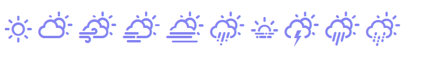

# weathericons


<!-- badges: start -->
[](https://travis-ci.org/trafficonese/weathericons)
[](https://www.tidyverse.org/lifecycle/#stable)
[](https://codecov.io/gh/trafficonese/weathericons)
<!-- badges: end -->

The package adds support for the [weather-icons](https://erikflowers.github.io/weather-icons/) library.

<p align="center">
  
</p>

## Installation

``` r
remotes::install_github("trafficonese/weathericons")
```


## Example

Basic examples to create weathericons:

``` r
library(weathericons)
weathericon("wi-humidity")
weathericon("wi-forecast-io-rain")
weathericon("wi wi-yahoo-7", rotate = "90")
weathericon("wi wi-yahoo-7", flip = "vertical")
weathericon("wi wi-wind", towards = "sse")
weathericon("wi-wind", from = "sse")
weathericon("wi wi-wind", towards = 40)
weathericon("wi wi-wind", from = 40)
```

List all icons:

``` r
shiny::runApp(system.file("examples/app.R", package = "weathericons"), 
              display.mode = "showcase")
```

Customize icons example with CSS:

``` r
shiny::runApp(system.file("examples/app_classes.R", package = "weathericons"), 
              display.mode = "showcase")
```

Using JS functions and inline styling:
``` r
shiny::runApp(system.file("examples/js_functions.R", package = "weathericons"),
              display.mode="showcase")
```

Leaflet popups and labels with weathericons:

``` r
shiny::runApp(system.file("examples/leaflet_popup.R", package = "weathericons"), 
              display.mode = "showcase")
```

Weathericons as SVG:

``` r
shiny::runApp(system.file("examples/svgs_app.R", package = "weathericons"), 
              display.mode = "showcase")
```
